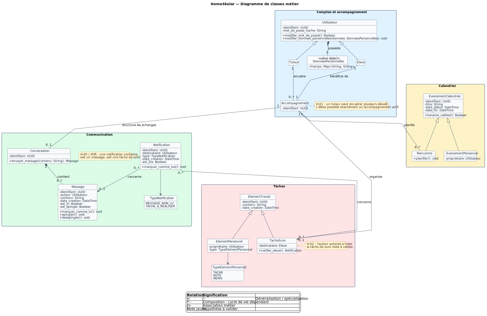

# Diagramme de classes UML

Le modèle canonique de HomeSkolar est maintenu en PlantUML afin que la source et
son rendu restent versionnés ensemble.

- [Documentation, conventions et traçabilité](../diagrams/uml/README.md)
- [Source PlantUML](../diagrams/uml/diagramme-classes-homeskolar.puml)
- [Rendu SVG](../diagrams/uml/diagramme-classes-homeskolar.svg)
- [Dossier de validation du mentor](../diagrams/uml/validation-mentor.md)
- [Cahier des charges avec intégration UML candidate](../../livrables/intermediaires/OC-PY03_Cahier_des_charges_Phases_1_2_UML-candidat.odt)

Statut : **version candidate contrôlée, en attente de validation humaine par le
mentor**. Elle ne doit pas être considérée comme définitivement validée avant ce
retour.
